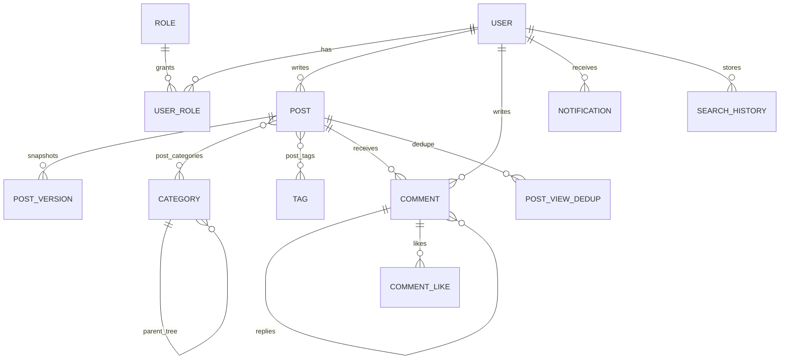

# Database design — Person Blog

## Overview

Relational schema (MySQL 8) managed by **Prisma** (`apps/api/prisma/schema.prisma`). UTF8MB4 throughout.

## ER (conceptual)

## Tables (summary)

| Table | Purpose |
|-------|---------|
| `users` | Credentials, profile JSON fields, `theme_preference`, `avatar_url` |
| `roles`, `user_roles` | RBAC (`admin`, `user`) |
| `refresh_tokens` | Hashed refresh tokens for rotation |
| `email_verification_tokens`, `password_reset_tokens` | One-time hashed tokens |
| `posts` | Article body (`html_content`), `status`, `pinned`, `hidden`, `view_count`, soft `deleted_at` |
| `post_versions` | Last **5** HTML snapshots per post |
| `categories` | Tree via `parent_id`, `sort_order` |
| `tags`, `post_tags`, `post_categories` | Many-to-many |
| `comments` | Nested `parent_id`, `status`, `like_count` |
| `comment_likes`, `comment_reports` | Like uniqueness, abuse reports |
| `notifications` | JSON payload + `read_at` |
| `search_history` | Recent queries per user |
| `post_view_dedup` | Fallback when Redis absent: unique (`post_id`, `viewer_hash`) + `expires_at` |

## Indexes and performance

- `posts.slug` UNIQUE; composite `posts(status, published_at DESC)` for public lists; `posts(view_count)` optional for “hot” sorts.
- `comments(post_id, status, created_at)` for moderation and public thread reads.
- `post_versions(post_id)` for version pruning.
- `notifications(recipient_id, read_at)` for inbox.
- **Full-text (optional upgrade):** add InnoDB `FULLTEXT(title, html_content) WITH PARSER ngram` via migration for better Chinese relevance; current app uses `LIKE` for portability.

## View counting

- Counter column: `posts.view_count`.
- Dedupe: Redis `SETNX` key `view:{postId}:{viewerHash}` TTL 24h; else `post_view_dedup` upsert + expiry window.

## Backup

Logical backups via `mysqldump` (see `BackupService`); rotate `.sql` files under `BACKUP_DIR`.
